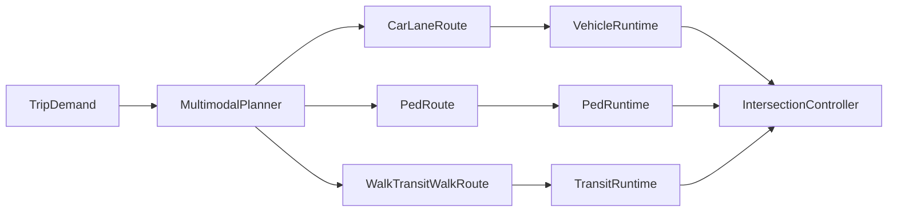
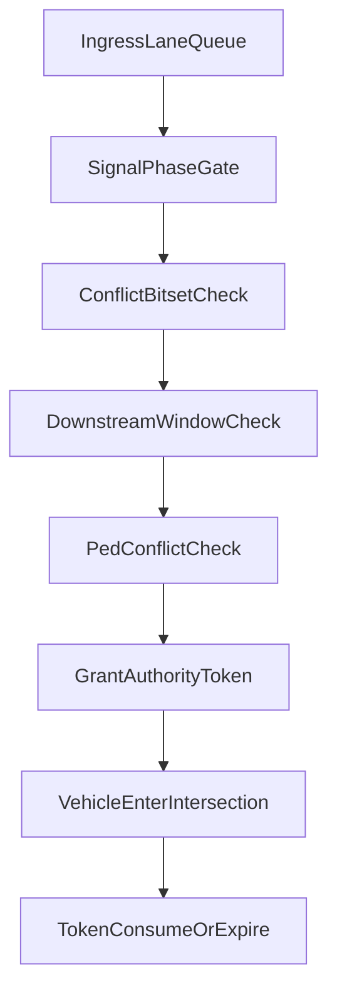
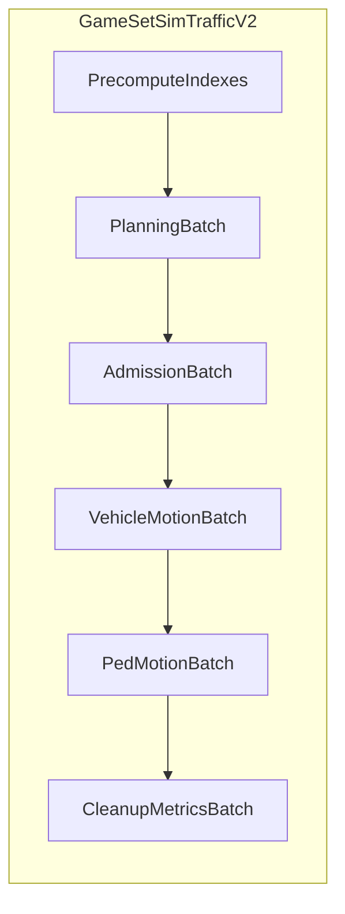

# Архитектура Traffic V2 (Lane-First)

## Область и цели

- Профиль приоритета: **balanced** (детерминизм + масштаб + реалистичное локальное поведение).
- Режимы в v1: **walk + car + public transport** (транзит интегрируется сразу, не откладывается).
- Ключевые точки интеграции: [src/game/transport/lane_graph.rs](src/game/transport/lane_graph.rs), [src/game/traffic/intersection/reservations.rs](src/game/traffic/intersection/reservations.rs), [src/game/intersections/lights.rs](src/game/intersections/lights.rs), [src/game/citizens.rs](src/game/citizens.rs), [src/game/pedestrians/routing.rs](src/game/pedestrians/routing.rs), [src/game/debug_world.rs](src/game/debug_world.rs).

## Жесткие инварианты (без компромиссов)

- **I1 RouteUnit**: Маршрут автомобиля — это последовательность lane-level примитивов, никогда не просто road tiles.
- **I2 AuthorityBeforeEntry**: Въезд в любую conflict area (перекресток/слияние с переходом) требует валидного movement authority token.
- **I3 NoBoxBlocking**: Authority выдается только при наличии окна емкости downstream lane.
- **I4 Determinism**: Одинаковый seed + одинаковые входы + одинаковое число тиков дают идентичные решения маршрутизации/допуска.
- **I5 ConflictExactness**: Конфликты движений на перекрестке вычисляются по lane-to-lane движениям, а не по грубой tile-эвристике.
- **I6 SignalSafety**: Yellow/all-red и пешеходные фазы — первоклассные ограничения и в admission, и в ETA-оценке.
- **I7 MultimodalConsistency**: Выбор режима/маршрута использует единую generalized-cost модель для walk/car/transit.

## Базовая архитектура




### 1) Топология полос и модель движений

- Extend [src/game/transport/lane_graph.rs](src/game/transport/lane_graph.rs):
  - Keep `LaneId` as canonical node key.
  - Add explicit `LaneConnectorId` for intersection internal connectors (конец входной полосы -> начало выходной).
  - Add lane attributes: speed limit, class, turn permissions, priority class.
- Add movement graph resource (`IntersectionMovementGraph`):
  - `MovementId` = легальное lane-to-lane движение через перекресток.
  - `ConflictBitset` на каждое движение (включая пешеходные конфликты).
  - `SignalGroupId` для маппинга движения к группе светофора.

### 2) Стек pathfinding (Lane-First)

- Replace tile route payload в [src/game/transport/path_pool.rs](src/game/transport/path_pool.rs) на lane-aware route segments:
  - `RouteSegment::LaneFollow { lane_id }`
  - `RouteSegment::Connector { movement_id, connector_id }`
  - `RouteSegment::TransitLeg { line_id, stop_from, stop_to }`
  - `RouteSegment::WalkEdge { ped_edge_id }`
- Конвейер планировщика:
  - **Macro pass**: pruning по регионам/коридорам (reuse [src/game/transport/pathfinding/regions.rs](src/game/transport/pathfinding/regions.rs)).
  - **Lane pass**: A* по lane+connector graph.
  - **Time-dependent costs**: ожидаемая задержка светофора + измеренная очередь + штраф смены полосы + штраф маневра.
- Cost function (детерминированная):
  - `g = travel_time + signal_delay_est + queue_delay_est + lane_change_penalty + maneuver_penalty + reliability_penalty`.
- Reroute triggers:
  - деградация ETA выше порога, threshold stuck timer, рост topology version.

### 3) Intersection Controller (строгий admission)

- Replace coarse reservation behavior в [src/game/traffic/intersection/reservations.rs](src/game/traffic/intersection/reservations.rs) на allocator movement-authority:
  - Входные очереди по каждой ingress lane.
  - Проверки реализуемости в порядке:
    - signal gate,
    - conflict bitset,
    - downstream capacity window,
    - конфликты с pedestrian crossing,
    - anti-blocking guard.
  - Поля authority token: `movement_id`, `vehicle_entity`, `issued_tick`, `ttl_ticks`, `exit_lane_id`.
- Управление fairness и starvation:
  - Aging priority boost.
  - Ограничение подряд выданных grants на movement group.
  - Канал preemption для emergency/service.




### 4) Светофорная система и связь с маршрутизацией

- Refactor [src/game/intersections/lights.rs](src/game/intersections/lights.rs):
  - Define phase plans by `SignalGroupId` (не direction-only booleans).
  - Support min green, max green, yellow, all-red, pedestrian call windows.
- Эффекты сигналов:
  - Runtime admission: жесткий gate по текущей фазе.
  - Routing: планировщик использует скользящие метрики `expected_wait_by_movement`.
- Политика right-turn-on-red:
  - Кодируется как опциональная policy движения со строгими ped/conflict проверками, без ad-hoc state overrides.

### 5) Пешеходная и мультимодальная маршрутизация

- Сохранить базу pedestrian graph в [src/game/pedestrians/graph.rs](src/game/pedestrians/graph.rs), но интегрировать crossing edges с intersection movement graph.
- Расширить mode choice в [src/game/citizens.rs](src/game/citizens.rs):
  - Candidate itineraries: walk-only, car-only, walk-transit-walk, car-park-ride-transit (последний можно включить флагом на старте).
  - Единая generalized utility function:
    - `U = in_vehicle_time + walk_weight*walk_time + wait_weight*wait_time + transfer_penalty + fare_weight*fare + reliability_penalty`.
  - Детерминированный tie-breaker по стабильному ключу.
- Интеграция транзита:
  - Связать stop nodes с ped graph edges и transit line graph edges.
  - В планировщике добавить schedule-aware оценку waiting time.

### 6) ECS расписание (фиксированный порядок)

- Целевой порядок в FixedUpdate:
  - topology/version sync
  - signal update
  - demand/queue build (vehicle + pedestrian)
  - бюджет multimodal replanning
  - intersection authority allocation
  - longitudinal/lateral update автомобилей
  - update пешеходов
  - cleanup token + cleanup stale route
- Убрать циклические зависимости между state update и созданием reservations.

### 7) Persistence и детерминизм

- Расширить persistence contracts в [src/game/persistence_contract.rs](src/game/persistence_contract.rs):
  - Сохранять lane routes, активные authority tokens, таймеры фаз светофора, курсор мультимодального itinerary.
- Гарантии deterministic replay:
  - Стабильный порядок итерации кандидатов.
  - Отсутствие wall-clock в симуляционных решениях.

### 8) Наблюдаемость и acceptance gates

- Добавить MCP/debug snapshots в [src/game/debug_world.rs](src/game/debug_world.rs):
  - `DebugIntersectionControlSnapshot` (queues, grants, denials по причинам)
  - `DebugSignalSnapshot` (phase, timers, demand)
  - `DebugMultimodalSnapshot` (доли режимов, utility deltas)
  - `DebugPathfindingSnapshot` (A* expansions, cache hit rate, причины reroute)
- Обязательные acceptance-тесты:
  - отсутствие wrong-way movements,
  - отсутствие конфликтов в intersection movements,
  - соблюдение no-box-blocking инварианта,
  - bounded starvation под высокой нагрузкой,
  - адекватный multimodal mode-choice под congestion.

## Стратегия миграции

- Включить новый стек под feature flag (`traffic_v2`) и вести shadow metrics против старых систем во время rollout.
- Поэтапный rollout:
  - P1 lane route payload + cache/version contract,
  - P2 movement graph + strict authority allocator,
  - P3 signal-group refactor + delay-coupled routing,
  - P4 multimodal planner с transit,
  - P5 cleanup legacy reservation/connectors path.
- Перед включением по умолчанию каждая фаза требует parity dashboards и целевых regression tests.

## Детализация реализации и обоснование выбора

### A) Модель дорожной сети: почему lane-first, а не road-tile-first

- Целевая модель:
  - `LaneId` — атомарная единица движения.
  - `LaneConnectorId` — атомарный маневр внутри перекрестка.
  - `MovementId` — легальное lane-to-lane движение с конфликтами и сигнал-группой.
- Почему так:
  - Road-tile модель теряет информацию о том, в какой полосе агент находится, что напрямую ломает корректность маневров (особенно left/right turn и merge).
  - Lane-first дает формально проверяемые инварианты безопасности (конфликт определяется между движениями, а не «примерно по тайлам»).
- Альтернативы:
  - **Вариант 1: только road tiles**: проще код, но слабая безопасность и постоянные edge-case костыли на перекрестках.
  - **Вариант 2: lane graph + connectors (выбран)**: баланс сложности и точности.
  - **Вариант 3: непрерывная геометрия (spline/continuous)**: максимальная реалистичность, но слишком дорогая миграция и риск просадки производительности для текущих целей.
- Жесткое правило:
  - Любое решение о приоритете/конфликте/сигнале должно ссылаться на `MovementId`, не на «тип тайла».

### B) Поиск пути: точная схема и причины

- Выбранная схема:
  1. **Macro pruning** по регионам (уменьшает пространство поиска).
  2. **Lane-level A-star** по графу полос и коннекторов.
  3. Time-dependent cost на основе сигналов/очередей.
- Стоимость пути:
  - `travel_time` (база),
  - `signal_delay_est` (ожидание фаз),
  - `queue_delay_est` (локальная загрузка),
  - `lane_change_penalty`,
  - `maneuver_penalty`,
  - `reliability_penalty` (штраф за нестабильные участки).
- Почему это выбранный вариант:
  - Дает предсказуемую производительность и контроль качества маршрутов.
  - Не требует полной перестройки симуляции в time-expanded graph.
- Альтернативы:
  - **Статический A-star**: быстро, но не видит задержки светофоров/очередей.
  - **Time-expanded graph**: очень точно, но дорого по памяти/CPU в реальном времени.
  - **DStar/LPAStar**: хорошо для динамики, но сложнее обеспечить детерминизм и стабильный profiling.
- Жесткое правило:
  - В route cache ключ включает topology version + routing profile + mode class.

### C) Перекрестки: строгий admission через movement authority

- Выбранная схема:
  - Перед входом на conflict area агент обязан получить `AuthorityToken`.
  - Токен выдается allocator’ом на основе проверок:
    1. сигнал,
    2. conflict bitset,
    3. downstream window,
    4. ped conflict,
    5. anti-blocking.
- Почему так:
  - Это устраняет главный класс deadlock/starvation багов «вижу путь, но не могу безопасно войти».
  - Делает поведение проверяемым по reason-code отказа.
- Альтернативы:
  - **FCFS по стоп-линии**: простая, но системно несправедливая и плохо масштабируется.
  - **Текущие coarse zones**: быстро внедряется, но недостаточно точна на сложной геометрии.
  - **Полная физическая negotiation-модель**: реалистична, но дорогая и сложная для детерминизма.
- Жесткое правило:
  - Вход без токена запрещен всегда, кроме explicitly documented аварийного режима recovery.

### D) Светофоры: как влияют на маршрут и исполнение

- Выбранная схема:
  - Управление через `SignalGroupId`, а не только через cardinal направления.
  - Фазовый автомат: `min_green`, `max_green`, `yellow`, `all_red`, `ped_call_windows`.
- Эффект на runtime:
  - Admission gate использует только текущую фазу + policy движения.
- Эффект на pathfinding:
  - Planner учитывает `expected_wait_by_movement` (rolling estimate).
- Альтернативы:
  - **Fixed-time only**: простая, но плохо реагирует на нагрузку.
  - **Fully adaptive RL**: потенциал высокий, но нестабильность и сложная верификация.
  - **Hybrid actuated (выбран)**: предсказуемость + реакция на локальный спрос.
- Жесткое правило:
  - Любая policy (включая right-on-red) обязана проходить ped+conflict gate.

### E) Пешеходы и их приоритеты

- Выбранная схема:
  - Пешеход — полноценный участник с собственным graph-routing.
  - Пешеходные crossing edges интегрированы в `IntersectionMovementGraph`.
  - Vehicle admission учитывает ped crossing как hard constraint для конфликтующих движений.
- Почему так:
  - Иначе конфликт пешеходов и автомобилей становится локальными «if-правками», а не системным правилом.
- Альтернативы:
  - **Пешеходы как внешний шум**: проще, но ломает безопасность и правдоподобие.
  - **Независимый pedestrian simulator без связи с intersection controller**: даёт рассинхрон и race-condition.
- Жесткое правило:
  - Если pedestrian movement конфликтует с vehicle movement, vehicle grant запрещен.

### F) Мультимодальный выбор (walk/car/transit): почему utility-модель

- Выбранная схема:
  - Формируем набор кандидатов маршрута (walk-only, car-only, walk-transit-walk, опционально park-and-ride).
  - Считаем generalized utility `U` и выбираем детерминированно.
- Почему так:
  - Пороговые правила типа «если дистанция < X — walk» слишком грубые, не учитывают светофоры, ожидание и пересадки.
  - Utility-модель позволяет калибровать поведение без переписывания архитектуры.
- Альтернативы:
  - **Rule-based thresholds**: быстро, но ломается при росте числа режимов.
  - **ML/RL выбор режима**: гибко, но слабая объяснимость/воспроизводимость.
- Жесткое правило:
  - Tie-break всегда стабильный (entity id / deterministic hash), никаких случайных решений в runtime.

### G) ECS-схема владения данными

- Ресурсы:
  - `LaneGraph`, `IntersectionMovementGraph`, `SignalState`, `AuthorityAllocatorState`, `MultimodalPlannerState`.
- Компоненты:
  - `VehicleRouteCursor`, `PedRouteCursor`, `TransitLegCursor`, `AuthorityToken`.
- Системы:
  - Строго фиксированный порядок (сначала world-state, потом planning, потом admission, потом movement, потом cleanup).
- Почему так:
  - Убирает циклические зависимости и временные race-condition.
- Альтернативы:
  - **Event-heavy без фиксированного порядка**: гибко, но труднее поддерживать детерминизм.

### H) Наблюдаемость: что и зачем меряем

- Добавляем обязательные reason-codes отказа grant:
  - `SignalClosed`, `ConflictOccupied`, `DownstreamFull`, `PedConflict`, `AntiBlock`.
- Добавляем обязательные метрики:
  - grant rate, denial mix, starvation age p95/p99,
  - reroute rate и причины,
  - mode share и generalized cost delta.
- Почему так:
  - Без reason-code невозможно быстро диагностировать deadlock и несправедливость admission.

### I) Примеры сравнения вариантов на одном сценарии

- Сценарий: плотный Т-узел, высокий pedestrian поток, частые right-turn.
  - **Coarse zones**: легко допускают ложные блокировки или ложные пропуски.
  - **Movement authority (выбран)**: точный конфликт, объяснимый deny, стабильная пропускная способность.
- Сценарий: маршрут 2 км в часы пик.
  - **Tile A-star**: «короткий» путь, но хуже по ETA из-за фаз и очередей.
  - **Lane time-dependent A-star (выбран)**: длиннее по геометрии, но лучше по фактическому времени.

## Стратегия миграции (детально по файлам)

### P1: Route payload и version-contract

- Изменить [src/game/transport/path_pool.rs](src/game/transport/path_pool.rs): lane-aware `RouteSegment`.
- Изменить [src/game/transport/pathfinding/cache.rs](src/game/transport/pathfinding/cache.rs): расширенный ключ кэша.
- Обновить потребителей маршрутов в [src/game/traffic/movement/drive.rs](src/game/traffic/movement/drive.rs).
- Критерий готовности:
  - Нет деградации FPS/памяти выше согласованного порога, route replay детерминирован.

### P2: Movement graph и authority allocator

- Добавить новый модуль `intersection/movements` (рядом с [src/game/traffic/intersection/zones.rs](src/game/traffic/intersection/zones.rs)).
- Перевести admission в [src/game/traffic/intersection/reservations.rs](src/game/traffic/intersection/reservations.rs) на token allocator.
- Критерий готовности:
  - `NoBoxBlocking` и `AuthorityBeforeEntry` выполняются на всех regression-сценариях.

### P3: Signal-group refactor

- Рефактор [src/game/intersections/lights.rs](src/game/intersections/lights.rs) под `SignalGroupId`.
- Добавить экспорт `expected_wait_by_movement` в pathfinding costs.
- Критерий готовности:
  - ETA-предсказания не расходятся с фактическим временем выше заданного budget.

### P4: Walk+car+transit planner

- Расширить [src/game/citizens.rs](src/game/citizens.rs) для utility-based mode choice.
- Интегрировать transit edges в pedestrian/transit layers ([src/game/pedestrians/routing.rs](src/game/pedestrians/routing.rs), [src/game/public_transport.rs](src/game/public_transport.rs)).
- Критерий готовности:
  - Стабильные доли режимов и корректные пересадки в тестовых сценариях.

### P5: Выключение legacy логики

- Убрать legacy reservation/connectors ветки после parity validation.
- Очистить старые конфиги и неиспользуемые debug поля.
- Критерий готовности:
  - Все acceptance и performance gates зелёные минимум N прогонов подряд.

## Правила принятия решений (без отступлений)

- Если решение противоречит I1–I7, оно отклоняется без обсуждения.
- Если новая эвристика не объяснима reason-code’ами, она не принимается.
- Если улучшение реалистичности ломает детерминизм — отклоняется для основной ветки.
- Если оптимизация ухудшает безопасность admission — отклоняется.

## Выбор подхода (3 варианта и финальная рекомендация)

- Подход A: эволюционно улучшать текущий стек (`reservations + connectors + tile residual`), постепенно добавляя проверки.
  - Плюсы: минимальная миграционная стоимость, быстрые первые результаты.
  - Минусы: наследует архитектурные компромиссы, растет сложность «костылей», слабая объяснимость deadlock-причин.
- Подход B: полный clean-slate трафикового ядра в новом модуле, затем одномоментное переключение.
  - Плюсы: максимально чистая архитектура и минимальная техническая задолженность.
  - Минусы: высокий риск интеграционных регрессий, долгий период без пользовательской ценности, сложный cutover.
- Подход C (выбран): гибридный lane-core rewrite + пофазная интеграция через feature flags и shadow metrics.
  - Плюсы: сохраняем архитектурную чистоту в критическом контуре (маршрут + admission + signal coupling), но контролируем риск через пошаговый rollout.
  - Минусы: временно поддерживаем dual-path и повышаем стоимость сопровождения до завершения P5.
- Почему выбран C:
  - Требование «без возможных отступлений» достигается только формализацией ядра (lane/movement/token).
  - Требование «детально и практически внедряемо» требует пофазной миграции, а не big-bang.

## Спецификация алгоритмов и контрактов

### 1) Канонические типы и версии

```rust
type Tick = u64;
type TopologyVersion = u64;
type SignalPlanVersion = u64;

#[derive(Clone, Copy, Eq, PartialEq, Hash, Ord, PartialOrd)]
struct LaneId(u32);
#[derive(Clone, Copy, Eq, PartialEq, Hash, Ord, PartialOrd)]
struct LaneConnectorId(u32);
#[derive(Clone, Copy, Eq, PartialEq, Hash, Ord, PartialOrd)]
struct MovementId(u32);
#[derive(Clone, Copy, Eq, PartialEq, Hash, Ord, PartialOrd)]
struct SignalGroupId(u16);
```

- Контракт:
  - Все ID стабильны внутри `TopologyVersion`.
  - Любое изменение геометрии/разрешенных поворотов/сигнальных групп обязано повышать `TopologyVersion`.
  - Любое изменение фазового плана обязано повышать `SignalPlanVersion`.

### 2) Контракт маршрута и курсора исполнения

```rust
enum RouteSegment {
    LaneFollow { lane_id: LaneId },
    Connector { movement_id: MovementId, connector_id: LaneConnectorId },
    WalkEdge { ped_edge_id: u32 },
    TransitLeg { line_id: u32, stop_from: u32, stop_to: u32 },
}

struct RoutePlan {
    segments: Vec<RouteSegment>,
    topology_version: TopologyVersion,
    signal_plan_version: SignalPlanVersion,
    planned_tick: Tick,
}

struct RouteCursor {
    seg_idx: u32,
    lane_progress_m: f32,
}
```

- Контракт:
  - `Connector` всегда должен следовать после валидного `LaneFollow` ingress.
  - Исполнение маршрута запрещено, если версия плана устарела и сегмент не в safe-continue зоне.
  - Reroute разрешен только в «стабильных точках» (вне conflict area, либо после token consume).

### 3) Pathfinding (lane-first, time-dependent A-star)

- Вход:
  - стартовый `LaneId`/`PedNodeId`,
  - целевой набор `GoalCandidates`,
  - профиль режима (`walk`, `car`, `walk_transit_walk`),
  - срез метрик задержек (квантованный по tick buckets).
- Выход:
  - детерминированный `RoutePlan` + декомпозиция стоимости.
- Псевдокод:

```text
plan_route(req):
  key = (origin, destination, mode, topology_version, signal_plan_version, cost_profile_version)
  if cache.hit(key): return cache.value(key)

  corridor = macro_prune(req.origin_region, req.goal_region)
  open = BinaryHeap ordered by (f_cost, tie_break_key)
  g_cost[start] = 0

  while open not empty and expansions < budget:
    n = pop_min(open)
    if is_goal(n): return reconstruct(n)
    for edge in outgoing_lane_or_connector_edges(n, corridor):
      t = g_cost[n] + edge.travel_time
      t += expected_signal_delay(edge.movement_id, t)
      t += expected_queue_delay(edge.downstream_lane_id, t)
      t += lane_change_penalty(edge)
      t += maneuver_penalty(edge)
      t += reliability_penalty(edge)
      relax(n, edge.to, t, deterministic_parent_rule)

  return bounded_fallback(req)
```

- Детали детерминизма:
  - `tie_break_key = (f_cost_q, g_cost_q, node_id, parent_node_id)`.
  - Все float в cost сравниваются после квантизации (`millis`/`centiseconds`), чтобы исключить дрейф.
- Почему не time-expanded graph:
  - Он точнее, но не проходит по memory budget на больших городах без агрессивной компрессии.

### 4) Admission allocator (movement-authority)

- Вход: ingress queues, signal state, conflict occupancy, downstream windows, pedestrian claims.
- Выход: список `Grant` и `Deny{reason}` на текущий tick.
- Псевдокод:

```text
allocate_authority(tick):
  candidates = collect_heads_of_ingress_queues()
  sort(candidates, by = fairness_score desc, then stable_entity_id asc)

  for c in candidates:
    if !signal_open(c.movement_id): deny(c, SignalClosed); continue
    if conflict_occupied(c.movement_id): deny(c, ConflictOccupied); continue
    if !has_downstream_window(c.exit_lane_id): deny(c, DownstreamFull); continue
    if ped_conflict_active(c.movement_id): deny(c, PedConflict); continue
    if would_box_block(c): deny(c, AntiBlock); continue

    grant_token(c, ttl_ticks_for(c.movement_id))
    mark_conflict_occupied(c.movement_id)
    reserve_downstream_window(c.exit_lane_id)
```

- Контракт токена:
  - Токен одноразовый, привязан к `(entity, movement_id, issued_tick)`.
  - Просроченный токен auto-expire и публикует reason `TokenExpired`.
  - Повторное использование токена запрещено и считается invariant violation.

### 5) Фазовый движок сигналов

- Состояния автомата:
  - `Green(group_set)` -> `Yellow(group_set)` -> `AllRed` -> `Green(next_group_set)`.
- Переходы:
  - `min_green` блокирует ранний выход,
  - `max_green` принуждает выход,
  - `ped_call_window` может вставлять пешеходные группы по приоритету.
- Интеграция с pathfinding:
  - Каждая `MovementId` публикует `expected_wait_by_movement[horizon_bucket]`.
  - Planner использует этот массив как add-on к `travel_time`.

### 6) Контракт пешеходов и cross-conflict

- Пешеходный crossing трактуется как `PedMovementId` и добавляется в общий конфликтный граф.
- Для любого `VehicleMovementId` поддерживается матрица пересечений с `PedMovementId`.
- Гарантия:
  - Если активен конфликтующий `PedMovementId`, `VehicleMovementId` не может получить grant.

### 7) Контракт выбора режима (walk/car/transit)

- Для каждого trip генерируются кандидаты режимов (минимум 2, максимум 4).
- Utility:
  - `U = ivt + w_walk*walk + w_wait*wait + transfer_penalty + fare_weight*fare + reliability_penalty`.
- Правило выбора:
  - Минимальный `U`, tie-break по `StableTripKey`.
- Ограничения:
  - Нельзя выбирать режим, если валидация маршрута не проходит по текущим версиям topology/signal plan.

### 8) Fallback и деградация без нарушения безопасности

- Если planner не укладывается в budget:
  - Разрешен упрощенный cost-profile (без долгого горизонта), но только вне conflict area.
- Если signal forecast недоступен:
  - Используется last-known rolling mean, помечается degraded flag.
- Если degraded flag активен:
  - admission safety-правила не ослабляются никогда.

## File-level blueprint (модули, символы, порядок интеграции)

### P1: Lane route payload + cache/version

- Добавить [src/game/transport/route_segments.rs](src/game/transport/route_segments.rs):
  - `RouteSegment`, `RoutePlan`, `RouteCursor`, валидаторы последовательности сегментов.
- Изменить [src/game/transport/path_pool.rs](src/game/transport/path_pool.rs):
  - хранение/выдача `RoutePlan` вместо tile-последовательностей.
- Изменить [src/game/transport/pathfinding/cache.rs](src/game/transport/pathfinding/cache.rs):
  - `PathCacheKey` расширяется версиями и mode profile.
- Изменить [src/game/traffic/movement/drive.rs](src/game/traffic/movement/drive.rs):
  - интерпретатор `RouteCursor` и переходы `LaneFollow -> Connector`.
- Изменить [src/game/transport/mod.rs](src/game/transport/mod.rs):
  - экспорт новых типов и feature gate wiring.

### P2: Movement graph + authority allocator

- Добавить [src/game/traffic/intersection/movements.rs](src/game/traffic/intersection/movements.rs):
  - `IntersectionMovementGraph`, `ConflictBitset`, `MovementMetadata`.
- Добавить [src/game/traffic/intersection/authority.rs](src/game/traffic/intersection/authority.rs):
  - `AuthorityToken`, `AuthorityAllocator`, `DenyReason`.
- Изменить [src/game/traffic/intersection/reservations.rs](src/game/traffic/intersection/reservations.rs):
  - адаптер совместимости (legacy API -> authority backend) на период P2-P4.
- Изменить [src/game/traffic/movement/state.rs](src/game/traffic/movement/state.rs):
  - явные состояния `AwaitingToken`, `Granted`, `Crossing`, `BlockedByReason`.

### P3: Signal-group engine + routing coupling

- Добавить [src/game/intersections/signal_groups.rs](src/game/intersections/signal_groups.rs):
  - описание групп, планов фаз, лимитов.
- Изменить [src/game/intersections/lights.rs](src/game/intersections/lights.rs):
  - новый state machine и публикация прогнозов ожидания.
- Изменить [src/game/transport/pathfinding/cost.rs](src/game/transport/pathfinding/cost.rs):
  - включение `expected_wait_by_movement`.
- Изменить [src/game/traffic/tests/intersection_reservations.rs](src/game/traffic/tests/intersection_reservations.rs):
  - переход тестов на reason-based denials.

### P4: Walk+car+transit unified planner

- Добавить [src/game/transport/multimodal/planner.rs](src/game/transport/multimodal/planner.rs):
  - генерация кандидатов, расчет utility, детерминированный выбор.
- Изменить [src/game/citizens.rs](src/game/citizens.rs):
  - хранение `TripModeDecision` и `ItineraryCursor`.
- Изменить [src/game/pedestrians/routing.rs](src/game/pedestrians/routing.rs):
  - crossing edges, связанные с movement graph.
- Изменить [src/game/public_transport.rs](src/game/public_transport.rs):
  - schedule-aware wait estimation API для planner.

### P5: Observability, persistence, legacy cleanup

- Изменить [src/game/debug_world.rs](src/game/debug_world.rs):
  - снапшоты по grant/deny, фазам, reroute причинам, mode shares.
- Изменить [src/game/persistence_contract.rs](src/game/persistence_contract.rs):
  - контракты сериализации токенов/фаз/курсов маршрутов.
- Изменить [src/game/persistence.rs](src/game/persistence.rs):
  - фактическое чтение/запись новых структур.
- Изменить [src/game/traffic/mod.rs](src/game/traffic/mod.rs):
  - окончательное выключение legacy pipeline после parity.

## Acceptance и performance budgets (численные gates)

### Профили нагрузки (единые для всех фаз)

- `S`: 2k vehicles, 5k pedestrians, 200 intersections.
- `M`: 8k vehicles, 20k pedestrians, 700 intersections.
- `L`: 20k vehicles, 50k pedestrians, 1500 intersections.

### Безопасность (обязательные нули)

- `wrong_way_movements = 0` на всех профилях.
- `movement_conflict_collisions = 0` на всех профилях.
- `entry_without_token = 0` на всех профилях.
- `ped_vehicle_conflict_grants = 0` на всех профилях.

### Живучесть и справедливость

- Deadlock detector:
  - при наличии спроса `grant_rate` не падает в ноль более чем на `T_deadlock = 300 ticks`.
- Starvation:
  - `queue_wait_ticks p99 <= 4 * cycle_time` на `M`, `<= 6 * cycle_time` на `L`.
- Reroute stability:
  - `reroute_per_trip p95 <= 3` на `M`, `<= 5` на `L`.

### Производительность (FixedUpdate budgets)

- `S`: p95 total traffic step <= 4.0 ms.
- `M`: p95 total traffic step <= 9.0 ms.
- `L`: p95 total traffic step <= 16.0 ms.
- Вклад планировщика:
  - p95 <= 35% общего бюджета шага на каждом профиле.
- Cache эффективность:
  - `path_cache_hit_rate >= 70%` на `M`, `>= 60%` на `L`.

### Качество ETA и mode-choice

- ETA error:
  - median absolute percentage error <= 20% на `M`.
- Signal coupling value:
  - time-dependent planner не хуже статического по travel time на `>= 90%` OD-пар.
- Mode stability:
  - колебание mode share между одинаковыми прогонами <= 1% (детерминизм).

## Расширенная матрица тестов (по фазам)

### P1 тесты

- Route segment validator:
  - запрет нелегальных последовательностей `Connector` без ingress lane.
- Version invalidation:
  - при изменении topology cache обязан инвалидироваться полностью по затронутому профилю.

### P2 тесты

- Conflict exclusivity:
  - одновременно не выдаются grant на конфликтующие `MovementId`.
- Downstream anti-block:
  - при полном exit lane grant запрещается с `DownstreamFull`.
- Token lifecycle:
  - issue -> consume/expire -> cleanup без дублей.

### P3 тесты

- Signal FSM correctness:
  - невозможен переход `Green -> Green` минуя `Yellow/AllRed`, если это запрещено планом.
- Forecast consistency:
  - `expected_wait_by_movement` обновляется не реже заданного интервала.

### P4 тесты

- Multimodal candidate completeness:
  - planner не выбирает режим вне множества валидных кандидатов.
- Ped-cross conflict:
  - активный ped crossing блокирует конфликтующие vehicle grants.

### P5 тесты

- Save/Load replay:
  - после load поведение admission и маршрутов совпадает на N тиков при одинаковом seed.
- Legacy parity:
  - при `traffic_v2=false` новая логика не влияет на старый pipeline.

## Матрица покрытия исходного запроса (проверка полноты)

- Требование: «навигация не по дорогам, а по полосам».
  - Закрывается: `RouteSegment::LaneFollow`, `LaneConnectorId`, lane-level A-star, route cursor contract.
- Требование: «поиск пути проработать до деталей».
  - Закрывается: time-dependent cost, cache key/versions, reroute triggers, fallback budget policy.
- Требование: «архитектура перекрёстков досканально, без отступлений».
  - Закрывается: movement graph, authority token, deny reason-codes, strict admission order, fairness/starvation policy.
- Требование: «светофоры и их влияние на маршрут».
  - Закрывается: signal-group FSM + `expected_wait_by_movement` в стоимости маршрута.
- Требование: «учесть пешеходов и выбор пешеходный/автомобильный маршрут».
  - Закрывается: ped movements в конфликтном графе + utility-based multimodal choice.
- Требование: «подробные обоснования и альтернативы».
  - Закрывается: блок `Выбор подхода`, разделы A-I, сравнительные сценарии.

## Формальная спецификация перекрестка (строгая)

### 1) Доменные объекты перекрестка

- `IngressLaneQueue`:
  - FIFO-очередь кандидатов на grant для каждой входной полосы.
  - В очереди хранится только head-агент + мета (age, class, planned movement).
- `MovementState`:
  - `movement_id`, `conflict_bitset`, `signal_group`, `exit_lane_id`.
- `ConflictOccupancy`:
  - битовая маска занятых конфликтных зон текущего тика.
- `DownstreamWindow`:
  - число доступных «слотов» в целевой полосе на горизонт `H` тиков.

### 2) FSM токена допуска

```rust
enum TokenState {
    Issued,     // выдан allocator'ом
    Consumed,   // агент начал вход в conflict area
    Expired,    // ttl вышел до входа
    Cancelled,  // принудительная отмена (topology/signal hard invalidation)
}
```

- Переходы:
  - `Issued -> Consumed`: только если агент head очереди и gate still valid.
  - `Issued -> Expired`: при `tick_now > issued_tick + ttl`.
  - `Issued -> Cancelled`: при глобальной инвалидации (например, критический rebuild узла).
- Инвариант:
  - `Consumed` и `Expired` терминальные; обратные переходы запрещены.

### 3) FSM автомобиля в зоне перекрестка

```rust
enum VehicleIntersectionState {
    Approach,        // движется к стоп-линии
    AwaitingToken,   // стоит в ingress queue
    Granted,         // токен получен, готов к въезду
    Crossing,        // находится в connector/conflict area
    ExitCommit,      // пересек конфликтную область, закрепляет exit lane
    BlockedByReason, // отказ с reason-code
}
```

- Переходы (без альтернативных веток):
  - `Approach -> AwaitingToken` при достижении зоны ожидания.
  - `AwaitingToken -> Granted` только по allocator grant.
  - `Granted -> Crossing` только при `token == Issued && gate recheck pass`.
  - `Crossing -> ExitCommit` после выхода из conflict geometry.
  - `Any -> BlockedByReason` при deny/expire/revoke.

### 4) Строгий порядок admission-проверок

- Порядок фиксирован и не может переупорядочиваться фичами:
  1. `SignalGate`
  2. `ConflictBitset`
  3. `DownstreamWindow`
  4. `PedConflictGate`
  5. `AntiBlockGuard`
- Обоснование:
  - Ранний `SignalGate` дешёвый и резко сокращает кандидатов.
  - `ConflictBitset` до `DownstreamWindow` уменьшает ложное резервирование downstream.
  - `PedConflictGate` до финального grant гарантирует safety без пост-фактум отката.

### 5) Fairness и bounded starvation

- Score кандидата:
  - `score = class_weight + age_boost + emergency_boost - consecutive_group_penalty`
- Определения:
  - `age_boost = floor(wait_ticks / age_quantum)`
  - `consecutive_group_penalty` растет при слишком длинной серии grant в одной группе.
- Жесткие правила:
  - Emergency/service канал может preempt обычные кандидаты, но только после conflict/ped checks.
  - Нельзя выдавать > `max_burst_per_group` grant подряд одной группе.

### 6) Обоснование выбранной fairness-модели

- Почему не чистый FCFS:
  - FCFS стабильно деградирует на асимметричных потоках и провоцирует starvation боковых направлений.
- Почему не сложная аукционная модель:
  - выше вычислительная стоимость и хуже объяснимость в отладке.
- Почему выбран score-based deterministic scheduler:
  - простая верификация причин решения + контролируемая справедливость + стабильный runtime.

## Lane-change / merge / weaving (детальный контракт)

### 1) Типы перестроений

- `MandatoryLaneChange`:
  - требуется для достижения нужного `MovementId` до intersection commit point.
- `DiscretionaryLaneChange`:
  - optional для выигрыша по ETA/queue.
- `MergeChange`:
  - слияние при исчезновении полосы или lane drop.

### 2) Правила mandatory lane-change

- Вводим `decision_horizon_m` и `commit_horizon_m`.
- Контракт:
  - Если до `commit_horizon_m` не найден безопасный gap, маршрут помечается `reroute_required`.
  - В зоне `commit_horizon_m` запрещены discretionary перестроения.

### 3) Safety gap модель

- Критерий безопасного перестроения:
  - `gap_front >= d_min_front(v_ego, v_front)`
  - `gap_back >= d_min_back(v_ego, v_back)`
- `d_min_*` вычисляются детерминированно через фиксированную модель времени реакции и торможения.
- Если безопасного окна нет:
  - кандидат откладывается, но не ломает основной lane-follow.

### 4) Merge priority policy

- Базовый приоритет у «прямой» полосы.
- Для merge-полосы применяется `zipper_rule` при низкой скорости потока.
- На перегрузе допускается локальный fairness override, но только без нарушения safety.

### 5) Почему так, а не «свободные» перестроения

- Свободные перестроения дают краткосрочный выигрыш, но вызывают волны торможения и рост конфликтов.
- Контрактная модель с commit horizon делает поведение предсказуемым и хорошо тестируемым.

## FixedUpdate: детальный пайплайн систем и владение данными

### Порядок систем (обязательный)

- `sync_topology_versions_system`
  - Reads: map/lane topology inputs.
  - Writes: `TopologyVersion`, invalidation events.
- `signal_phase_fsm_system`
  - Reads: detector inputs, ped calls.
  - Writes: `SignalState`, `expected_wait_by_movement`.
- `build_ingress_queues_system`
  - Reads: vehicle/ped positions, route cursors.
  - Writes: `IngressLaneQueue`, ped movement claims.
- `multimodal_replan_budget_system`
  - Reads: demand changes, congestion metrics.
  - Writes: updated `RoutePlan` for budgeted subset agents.
- `authority_allocate_system`
  - Reads: queues, conflicts, signal state, downstream windows.
  - Writes: `AuthorityToken`, deny logs.
- `vehicle_longitudinal_system`
  - Reads: tokens, leader/follower, route cursor.
  - Writes: speed/progress.
- `vehicle_lateral_lane_change_system`
  - Reads: lane-change intents, neighbor gaps.
  - Writes: lane assignments/cursor updates.
- `pedestrian_step_system`
  - Reads: ped routes + crossing permissions.
  - Writes: ped positions/states.
- `token_cleanup_and_metrics_system`
  - Reads: token states, grant/deny stats.
  - Writes: expired/consumed cleanup + debug snapshots.

### Жесткие ограничения на конфликты доступа

- `authority_allocate_system` — единственный writer токенов.
- `signal_phase_fsm_system` — единственный writer сигнального состояния.
- `multimodal_replan_budget_system` не пишет в token/signal ресурсы.
- Любое нарушение этих ownership-правил блокирует merge.

## Детерминизм вычислений (практическая спецификация)

### 1) Численная политика

- В стоимости маршрутов и score admission используем фиксированные единицы:
  - время: `i32 millis`,
  - дистанция: `i32 millimeters`,
  - utility: `i64 micro_cost`.
- Float допустим только в геометрии render/physics boundary, но не в ключевых compare/ordering решениях.

### 2) Порядок итераций

- Все коллекции кандидатов перед сравнением сортируются по стабильным ключам.
- Нельзя итерировать `HashMap`/`HashSet` без нормализации порядка для decision-critical логики.

### 3) RNG политика

- Для симуляционных решений RNG запрещен.
- Для деградированных fallback (если очень нужно) используется seeded deterministic RNG с логированием seed slice на тик.

### 4) Replay checksum

- Каждые `K` тиков считаем checksum по:
  - активным токенам,
  - состоянию фаз,
  - курсорам маршрутов топ-N агентов.
- Несовпадение checksum считается детерминизм-регрессией.

## Сценарии отказов и политика восстановления

### 1) Topology invalidation в момент движения

- Если invalidate вне conflict area:
  - immediate reroute.
- Если invalidate в conflict area:
  - агент завершает текущий `Connector`, после выхода обязательный reroute.

### 2) Резкий рост нагрузки (planner budget overflow)

- Включается degraded routing profile:
  - более короткий горизонт прогноза светофора,
  - сжатый список кандидатов lane-change.
- Safety правила admission остаются неизменны.

### 3) Аварийный отказ сигнального контроллера

- Фоллбек в безопасный all-red policy на affected intersection.
- Admission допускает только явно разрешенные emergency движения с усиленным ped gate.

### 4) Переполнение очередей

- Включается локальный anti-gridlock mode:
  - ужесточение downstream windows,
  - снижение burst в доминирующей группе,
  - приоритет разрядки блокированных подходов.

## Эксплуатационные артефакты (что обязательно иметь в PR)

- Дизайн-док обновлен с:
  - reason-code taxonomy,
  - diagram’ами FSM токена/автомобиля,
  - explicit ownership правил.
- Для каждой фазы P1-P5:
  - список changed files,
  - чек-лист acceptance gates,
  - rollback criterion.
- Для наблюдаемости:
  - минимум один MCP snapshot на каждый критичный контракт (signal, authority, reroute, mode-choice).

## Стартовые параметры V1 (чтобы начинать без неопределенности)

### 1) Admission и fairness defaults

- `age_quantum = 30 ticks`
- `max_burst_per_group = 4`
- `emergency_boost = +100` (выше любого обычного class_weight)
- `consecutive_group_penalty_step = 2`
- `token_min_ttl = 2 ticks`
- `token_max_ttl = 12 ticks`
- Формула TTL:
  - `ttl = clamp(ceil(connector_travel_time_ticks + 2), token_min_ttl, token_max_ttl)`

### 2) Lane-change defaults

- `decision_horizon_seconds = 4.0`
- `commit_horizon_seconds = 1.5`
- `mandatory_change_penalty = 250 micro_cost`
- `discretionary_change_penalty = 450 micro_cost`
- `failed_change_backoff = 20 ticks`
- Формула горизонтов:
  - `decision_horizon_m = max(25m, v_current * decision_horizon_seconds)`
  - `commit_horizon_m = max(8m, v_current * commit_horizon_seconds)`

### 3) Routing cost weights defaults

- `w_travel_time = 1.0`
- `w_signal_wait = 1.0`
- `w_queue_wait = 1.2`
- `w_lane_change = 0.8`
- `w_maneuver = 0.6`
- `w_reliability = 0.9`
- Замечание:
  - веса фиксируются в конфиге профиля и меняются только вместе с `cost_profile_version`.

### 4) Multimodal utility defaults

- `w_walk = 1.7`
- `w_wait = 2.1`
- `transfer_penalty = 180 sec equivalent`
- `fare_weight = 0.4 sec_per_currency_unit`
- `reliability_penalty_step = 60 sec equivalent`
- Rule:
  - после выбора режима сохраняется `chosen_mode_utility` для explain/debug snapshot.

### 5) Signal forecast defaults

- `forecast_bucket_ticks = 15`
- `forecast_horizon_buckets = 16`
- `queue_ema_alpha = 0.2`
- `min_green_default = 12 ticks`
- `max_green_default = 60 ticks`
- `yellow_default = 6 ticks`
- `all_red_default = 3 ticks`

### 6) Planner budget defaults

- `max_expansions_per_query = 20_000` (profile `M`)
- `max_planner_time_slice_ms = 2.0` (на тик для одного system run)
- `replan_budget_agents_per_tick = 128` (profile `M`)
- `eta_degradation_trigger = +25%` (от planned baseline)
- `stuck_trigger_ticks = 90`

## Калибровка и пересмотр параметров (процедура)

### Шаг 1: Базовая валидация безопасности

- Запускаем профили `S/M/L` без тюнинга весов.
- Требование:
  - все safety-ноли (conflict collisions, entry_without_token, ped conflict grants).
- Если не выполнено:
  - блок на любые perf-тюнинги до исправления safety.

### Шаг 2: Справедливость admission

- Смотрим `queue_wait_ticks p95/p99` и deny mix.
- Если p99 > budget:
  - повышаем `age_boost` или уменьшаем `max_burst_per_group`.
- Если проседает throughput:
  - уменьшаем `consecutive_group_penalty_step` в пределах safe envelope.

### Шаг 3: ETA и маршрутное качество

- Сравниваем static-cost baseline vs time-dependent.
- Если ETA error > target:
  - повышаем `w_queue_wait` или улучшаем forecast horizon.
- Если reroute churn высокий:
  - увеличиваем hysteresis для `eta_degradation_trigger`.

### Шаг 4: Мультимодальная устойчивость

- Проверяем стабильность mode share и transfer realism.
- Если transit недовыбирается при выгодном ETA:
  - снижаем `transfer_penalty` или `fare_weight`.
- Если walk переизбыточен на дальних OD:
  - повышаем `w_walk`.

### Шаг 5: Freeze policy

- После прохождения gates фиксируем профиль параметров:
  - увеличиваем `cost_profile_version`,
  - сохраняем changelog «параметр -> метрика -> эффект».
- В PR без changelog параметров merge запрещен.

## Explainability-контракт (почему система приняла именно это решение)

### Для каждого vehicle tick (debug mode)

- Публиковать:
  - `planned_movement_id`,
  - `grant_or_deny`,
  - `deny_reason` (если deny),
  - `candidate_score_breakdown`,
  - `downstream_window_state`,
  - `signal_phase_snapshot`.

### Для каждого trip decision (mode choice)

- Публиковать:
  - список кандидатов с `U` по каждому компоненту,
  - выбранный режим,
  - stable tie-break key.

### Для каждого reroute

- Публиковать:
  - trigger (`TopologyVersionChanged`, `EtaDegraded`, `StuckTimeout`, `LaneUnavailable`),
  - старый/новый ETA,
  - старый/новый route hash.

## Bevy Perf Blueprint (strict deterministic + staged_micro_batches)

### Принятое решение по производительности

- Политика: `strict_deterministic` (никаких ослаблений safety/детерминизма ради FPS).
- Архитектурный стиль: `staged_micro_batches`.
- Следствие:
  - Оптимизируем структуру систем и доступ к данным, а не упрощаем правила безопасности.

### 1) Контракт размера и ответственности систем

- Каждый hot-path system выполняет одну узкую функцию и не смешивает этапы `collect + decide + apply`.
- Цели времени на профиль `M`:
  - `p95 <= 0.35 ms` для типового micro-system,
  - `p95 <= 0.75 ms` как жесткий верхний порог для любого одиночного system в `GameSet::Sim`.
- Контракт доступа:
  - не более `1 ResMut` на систему (кроме явно согласованных агрегаторов),
  - не более `2 mut component` типов в одной системе,
  - ширина hot query ограничивается необходимым минимумом полей.
- Если система нарушает контракт:
  - обязательно делится на 2-3 системы до merge.

### 2) Query discipline: только нужные данные

- Правила:
  - Всегда добавлять `With/Without` фильтры для сужения архетипов.
  - Предпочитать два узких Query вместо одного широкого Query с `Option<&T>`.
  - Не читать `Entity`, если идентификатор не нужен логике.
  - Использовать `Changed/Added` для инкрементальных обновлений индексов/кэшей.
  - Запрещены full-world scans в hot-path без формального исключения.
- Практика:
  - `build_ingress_queues_system` читает только участников около stop-line, а не весь `Vehicle`.
  - `authority_allocate_system` работает по уже собранным очередям, а не делает Query по миру.
  - `token_cleanup_and_metrics_system` обрабатывает только токены с `Changed<TokenState>`/`Expired`.

### 3) Data-oriented split: hot/cold и archetype stability

- Компоненты делим на:
  - `hot` (каждый tick): позиция, скорость, lane cursor, token ref.
  - `warm` (эпизодически): route metadata, planner diagnostics.
  - `cold` (debug/telemetry): explainability breakdown, snapshots.
- Marker-компоненты редкого присутствия храним как `SparseSet`:
  - `AwaitingToken`, `BlockedByReason`, `RightTurnOnRed`, `LaneChangeIntent`.
- Запрещено в hot-loop:
  - частое add/remove тяжелых компонентов, вызывающее archetype churn.
- Рекомендация:
  - для временных состояний использовать компактные enum-поля в hot компоненте, а не частую смену структуры сущности.

### 4) Staged micro-batches внутри FixedUpdate



- `PrecomputeIndexes`:
  - micro-systems: `sync_topology_versions`, `signal_phase_fsm`, `build_ingress_queues`.
- `PlanningBatch`:
  - micro-systems: `multimodal_replan_budget`, `lane_change_intent`, `reroute_trigger_eval`.
- `AdmissionBatch`:
  - micro-systems: `collect_candidates`, `evaluate_signal_gate`, `evaluate_conflicts`, `evaluate_downstream`, `grant_or_deny`.
- `VehicleMotionBatch`:
  - micro-systems: `longitudinal_step`, `lateral_step`, `connector_commit`.
- `PedMotionBatch`:
  - micro-systems: `ped_crossing_step`, `ped_route_cursor_step`.
- `CleanupMetricsBatch`:
  - micro-systems: `token_cleanup`, `snapshot_emit`, `perf_counters_rollup`.

### 5) Параллелизм Bevy: где можно и где нельзя

- Можно параллелить:
  - `longitudinal_step` и `ped_route_cursor_step` (если нет shared mutable структур).
  - инкрементальные обновления индексов по disjoint данным.
- Нельзя параллелить без строгой изоляции:
  - `authority_allocate_system` (единый writer токенов и конфликтов),
  - любые системы, принимающие order-critical решения.
- `par_iter` policy:
  - используется только в системах без межсущностной конкуренции и без decision-order зависимости.
  - decision-critical этапы работают последовательно с deterministic sort.

### 6) Снижение scheduler overhead без укрупнения систем

- Группируем микросистемы в `SystemSet` стадии, чтобы:
  - минимизировать хаотичные `.after/.before` между десятками систем,
  - упростить чтение графа зависимостей,
  - сохранить параллельность внутри стадии.
- Контракт зависимостей:
  - межстадийные зависимости задаются на уровне set-chain,
  - внутристадийные — только когда реально нужен happens-before.
- Антипаттерн:
  - глобальная линейная цепочка из всех систем (`.chain()` на весь пайплайн).

### 7) Run conditions и budget guards

- Каждая дорогая система обязана иметь `run_if`:
  - по состоянию (`InGame`),
  - по наличию спроса/очередей,
  - по изменению версий/ресурсов.
- Planner budget guard:
  - лимит агентов на тик,
  - лимит expansions на запрос,
  - лимит общего time slice на тик.
- Admission budget guard:
  - лимит числа кандидатов на intersection/tick,
  - перенос хвоста очереди на следующий тик без нарушения fairness.

### 8) Event/message-first коммуникация вместо polling

- Для межмодульной связи использовать сообщения:
  - `RouteInvalidated`,
  - `AuthorityGranted`,
  - `AuthorityDenied`,
  - `SignalPlanChanged`.
- Запрещено:
  - дублирующий polling нескольких систем по одним и тем же большим Query.
- Эффект:
  - меньше лишних чтений мира и лучше кэш-локальность.

### 9) Индексы и кэши как first-class ресурсы

- Обязательные ресурсы:
  - `IngressLaneIndex`, `DownstreamCapacityIndex`, `MovementConflictIndex`, `RoutePlanCache`.
- Правила:
  - индекс обновляется инкрементально по changed events.
  - writer каждого индекса строго один.
  - кэши версионируются (`topology_version`, `signal_plan_version`, `cost_profile_version`).

### 10) Performance acceptance на уровне систем

- Дополнительно к общим бюджетам:
  - `top 3` самых дорогих systems не должны суммарно превышать `55%` бюджета `GameSet::Sim`.
  - количество systems с `p95 > 0.5 ms` на профиле `M` не более `2`.
  - full-world query systems в hot-path: `0` (кроме явно помеченного maintenance окна).
- Regression gate:
  - если после PR доля времени `authority + planning` выросла > `15%` без улучшения метрик качества, PR блокируется.

### 11) Bevy best practices (жесткие правила для этого плана)

- Системы должны быть малыми и тематически изолированными.
- Queries должны быть узкими и предикативными (`With/Without/Changed`).
- Решения в runtime принимаются только из подготовленных индексов, не из ad-hoc широких Query.
- Один writer на критичный ресурс (`SignalState`, `AuthorityTokens`, `ConflictOccupancy`).
- Decision-order системы сортируют кандидаты по стабильному ключу.
- Любая «оптимизация», которая ухудшает explainability (теряем reason-code), не принимается.

### 12) Интеграция в текущую структуру GameSet

- Сохраняем существующий контракт [src/game/sets.rs](src/game/sets.rs):
  - `GameSet::Sim` как основной fixed-step слой,
  - `GameSet::PostSim` для агрегатов/снимков.
- Внутри `GameSet::Sim` для Traffic V2 вводим под-наборы:
  - `TrafficV2Set::Precompute`,
  - `TrafficV2Set::Planning`,
  - `TrafficV2Set::Admission`,
  - `TrafficV2Set::VehicleMotion`,
  - `TrafficV2Set::PedMotion`,
  - `TrafficV2Set::Cleanup`.
- Это позволяет:
  - удержать системы маленькими,
  - ограничить data contention,
  - сохранить читаемую схему зависимостей.

