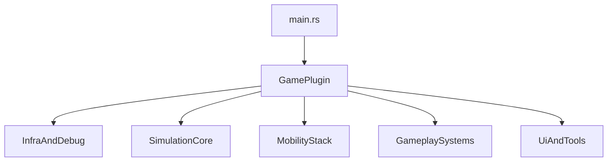

# Architecture

Этот документ описывает текущее устройство проекта по коду, а не по старым планам.

## App Composition

`src/main.rs` делает следующее:

- создаёт `App`
- включает `RemotePlugin` и `RemoteHttpPlugin`
- регистрирует `DefaultPlugins`
- включает `FrameTimeDiagnosticsPlugin`
- подключает `GamePlugin`
- печатает финальный debug dump при закрытии окна

`GamePlugin` в `src/game/mod.rs` — главный composition root. Он регистрирует state, resources, messages, plugin groups и system ordering.

## Plugin Graph

Фактические группы сейчас такие.

Infrastructure / debug:

- `ConfigLoaderPlugin`
- `PersistencePlugin`
- `PersistenceContractPlugin`
- `McpStatusPlugin`
- `DebugWorldPlugin`
- `UiSettingsPlugin`

Simulation core:

- `SimPlugin`
- `EconomyPlugin`
- `DemandPlugin`
- `EmploymentPlugin`
- `LandValuePlugin`
- `PollutionPlugin`
- `NotificationsPlugin`

Mobility stack:

- `TransportPlugin`
- `TrafficPlugin`
- `PedestriansPlugin`
- `IntersectionsPlugin`
- `PublicTransportPlugin`

Gameplay systems:

- `MapPlugin`
- `BuildingsPlugin`
- `CitizensPlugin`
- `ServicesPlugin`
- `EmergenciesPlugin`
- `ScenariosPlugin`
- `CustomBuildingsPlugin`
- `DayNightPlugin`
- `AudioSfxPlugin`
- `ZonePlacementPlugin`

UI:

- `UiPlugin`
- `CameraPlugin`

## App State

Глобальное состояние живёт в `AppState`:

- `MainMenu`
- `InGame`
- `Paused`

Практический нюанс: текущий startup flow dev-ориентирован. Ресурс `AutoStartTestCity` автоматически переводит игру из `MainMenu` в `InGame` и отправляет `LoadTestCity`.

## Schedules And Ordering

Глобальный порядок set-ов в `Update`:

1. `Input`
2. `CommandApply`
3. `Sim`
4. `PostSim`
5. `GraphUpdate`
6. `RenderSync`
7. `Ui`

Fixed-step симуляция:

- `FixedUpdate`
- базовый шаг: `1.0 / 10.0`
- в `FixedUpdate` явно цепляются `Sim -> PostSim`

Отдельный нюанс transport слоя:

- rebuild систем `RoadGraph`, `RegionGraph` и `LaneGraph` сейчас вешаются на `FixedUpdate` в `GraphUpdate`
- то есть часть graph maintenance идёт не в `Update`, а в fixed-step контуре

## Main Messages

Система коммуникации завязана на Bevy messages:

- `GameCommand`
- `TripRequested`
- `TripFinished`
- `DayAdvanced`

Это главный связующий слой между UI, map editing, гражданами, транспортом и persistence.

## Key Resources

- `MapGrid` — authoritative map state
- `City` — день, время, деньги, население, happiness
- `UiState` — текущий tool, overlay, speed, one-way mode
- `RoadGraph`, `RegionGraph`, `LaneGraph` — derived transport graphs
- `PathPool`, `PathCache`, `GraphVersion` — shared path storage and invalidation
- `TrafficOccupancy`, `TrafficIndex`, `TrafficSpatialIndex` — traffic read models and indices
- `ScenarioCatalog`, `ScenarioSelection`, `ScenarioProgress` — scenario runtime state
- `McpConnectionStatus` — BRP/MCP activity approximation

## Module Boundaries

Крупно проект сейчас делится так:

- `map`, `roads`, `zone_placement` — world editing and tile rules
- `buildings`, `demand`, `employment`, `economy`, `services`, `emergencies` — city simulation
- `citizens`, `trips`, `traffic`, `pedestrians`, `intersections`, `transport`, `public_transport` — mobility stack
- `persistence`, `persistence_contract`, `scenarios`, `custom_buildings` — runtime data surface
- `ui`, `ui_state`, `ui_settings`, `camera`, `telemetry`, `debug_world`, `mcp_status` — observability and UX

## Architectural Notes

- Это один crate, не workspace.
- Проект plugin-first, а не file-first: рабочая единица композиции тут plugin + resource + system sets.
- Код уже ушёл от "одна большая `traffic.rs` и `ui.rs`" в более дробные подсистемы, но single-crate pressure со временем останется архитектурным ограничением.
- Current-state documentation живёт в `docs/*.md`, а старые design/roadmap документы вынесены в `docs/archive/`.
