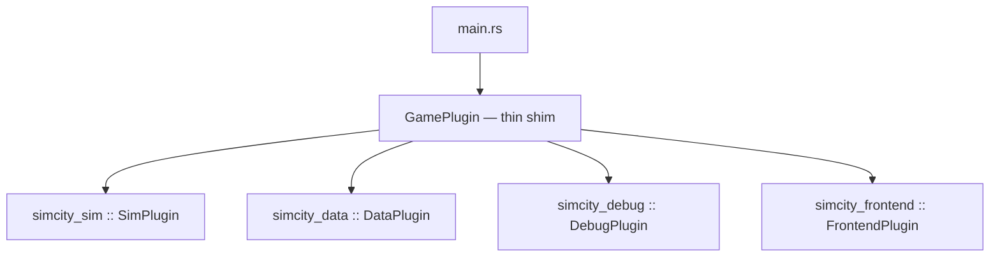

# Architecture

Этот документ описывает текущее устройство проекта по коду, а не по старым планам.

## App Composition

`src/main.rs` делает следующее:

- создаёт `App`
- включает `RemotePlugin` и `RemoteHttpPlugin`
- регистрирует `DefaultPlugins`
- включает `FrameTimeDiagnosticsPlugin`
- подключает `GamePlugin`
- печатает финальный debug dump при закрытии окна

`GamePlugin` в `src/game/mod.rs` — **тонкий шим** composition root: делает `pub use simcity_*::game::{...}` (поэтому старые пути вида `game::map`, `game::sim` работают) и добавляет по одному корневому плагину на крейт. State, resources, messages и system ordering регистрируются внутри `simcity_sim` (`SimPlugin::build` в `crates/simcity_sim/src/game/mod.rs`).

## Plugin Graph

Вложенные плагины по крейтам (фактический состав по коду):

`simcity_sim` (плюс здесь же: `AppState`, messages `GameCommand`/`TripRequested`/`TripFinished`/`DayAdvanced`, `UiState`, `configure_sets`):

- `BuildingsPlugin`, `CitizensPlugin`, `DemandPlugin`, `EconomyPlugin`, `EmergenciesPlugin`, `EmploymentPlugin`, `MapPlugin`
- `DayNightPlugin` (visual-only overlay), `ServicesPlugin`, `TransportPlugin`, `ZonePlacementPlugin`, `sim::SimPlugin`, `TrafficPlugin`
- `PedestriansPlugin`, `IntersectionsPlugin`, `LandValuePlugin`, `NotificationsPlugin`, `PollutionPlugin`, `PublicTransportPlugin`

`simcity_data`:

- `ConfigLoaderPlugin`, `PersistencePlugin`, `PersistenceContractPlugin`, `ScenariosPlugin`

`simcity_debug`:

- `McpStatusPlugin`, `DebugWorldPlugin`

`simcity_frontend`:

- `AudioSfxPlugin`, `CameraPlugin`, `UiPlugin`, `UiSettingsPlugin`

## App State

Глобальное состояние живёт в `AppState`:

- `MainMenu`
- `InGame`
- `Paused`

Практический нюанс: текущий startup flow dev-ориентирован. Ресурс `AutoStartTestCity` автоматически переводит игру из `MainMenu` в `InGame` и отправляет `LoadTestCity`.

## Schedules And Ordering

Глобальный порядок set-ов в `Update`:

1. `Input`
2. `CommandApply`
3. `GraphUpdate`
4. `Sim`
5. `PostSim`
6. `RenderSync`
7. `Ui`

Fixed-step симуляция:

- `FixedUpdate`
- базовый шаг: `1.0 / 10.0`
- в `FixedUpdate` явно цепляются `GraphUpdate -> Sim -> PostSim`

`GraphUpdate` идёт ДО `Sim` в обоих schedule: derived-графы (`RoadGraph`, `RegionGraph`, `LaneGraph`, lanelet-граф) пересобираются раньше любых сим-консьюмеров того же тика. Порядок запинен тестом `graph_rebuild_runs_before_sim_consumer_on_fixed_update` (`crates/simcity_sim/src/game/mod.rs`).

## Main Messages

Система коммуникации завязана на Bevy messages:

- `GameCommand`
- `TripRequested`
- `TripFinished`
- `DayAdvanced`

Это главный связующий слой между UI, map editing, гражданами, транспортом и persistence.

## Key Resources

- `MapGrid` — authoritative map state
- `City` — день, время, деньги, население, happiness
- `UiState` — текущий tool, overlay, speed, one-way mode
- `RoadGraph`, `RegionGraph`, `LaneGraph` — derived transport graphs
- `PathPool`, `PathCache`, `GraphVersion` — shared path storage and invalidation
- `TrafficOccupancy`, `TrafficIndex`, `TrafficSpatialIndex` — traffic read models and indices
- `ScenarioCatalog`, `ScenarioSelection`, `ScenarioProgress` — scenario runtime state
- `McpConnectionStatus` — BRP/MCP activity approximation

## Module Boundaries

Крупно проект сейчас делится так:

- `map`, `roads`, `zone_placement` — world editing and tile rules
- `buildings`, `demand`, `employment`, `economy`, `services`, `emergencies` — city simulation
- `citizens`, `trips`, `traffic`, `pedestrians`, `intersections`, `transport`, `public_transport` — mobility stack
- `persistence`, `persistence_contract`, `scenarios` — runtime data surface
- `ui`, `ui_state`, `ui_settings`, `camera`, `telemetry`, `debug_world`, `mcp_status` — observability and UX

## Architectural Notes

- Это Cargo workspace: бинарь `simcity_app` + 5 библиотечных крейтов с однонаправленными зависимостями — состав, границы и условия дальнейшего сплита описаны в `docs/crate-workspace.md`.
- Проект plugin-first, а не file-first: рабочая единица композиции тут plugin + resource + system sets.
- Current-state documentation живёт в `docs/*.md`, а старые design/roadmap документы вынесены в `docs/archive/`.

## Intersection Traffic Invariants (STRICT — соблюдать при любых правках трафика)

Выстрадано месяцами борьбы со «встречкой на перекрёстках» (2026-07). Тайлы бокса перекрёстка
(`dir == None`) **сознательно исключены** из всех направленных проверок — внутри бокса нет полос,
и корректность траекторий там держится **только на построении**, а не на валидации. Поэтому
правила ниже обязательны: нарушив их, вы получите визуальную езду по встречной половине
перекрёстка, которую не поймает ни один гард.

1. **Внутрибоксовые траектории поворотов строятся ТОЛЬКО прямоугольно** (`manhattan_turn_path`,
   `transport/lanelet/build.rs`): левый/правый — «Г» (левый идёт по своей полосе до линии «за
   центром» и выходит; правый прижат к ближнему углу), разворот — «П» с пивотом за центром, не
   заходя на дальнюю половину поперечной дороги. **Никаких угловых/дуговых обходов центра**:
   жадный угловой обход на неквадратных боксах (например, SixLane×FourLane = 4×6) вырождается в
   обход по периметру — машина едет по встречной стороне перекрёстка (ПДД 8.6). Прямые (`Straight`)
   обязаны выходить в ту же полосу (same-lane-index exit), перестроение внутри бокса запрещено.

2. **Направленная корректность маршрутов — один предикат на всех**:
   `route_is_direction_correct` / `first_oncoming_pair` (`transport/lanelet/pathfinding.rs`)
   проверяет и выезд С тайла против его направления, и **въезд НА тайл против его направления**
   (b-side — закрывает шаг «бокс → встречная полоса»). Каждый производитель маршрутов проходит
   через гард: пост-гард `find_route`, intern-гард каждого не-lanelet маршрута
   (`route_direction_ok` перед каждым `path_pool.intern` — stuck-реруты, lane change, swap-break
   и road-A* fallback спавна; отказы видны в `RouteProducerStats.guard_refusals`), инвалидация
   активных маршрутов при `GraphVersion` bump. **Новый производитель маршрутов обязан встать под
   тот же гард.**

3. **Конфликты перекрёстка = тайловое пересечение + семантика**: компактные Г/П-траектории могут
   не пересекаться тайлами с встречным потоком, поэтому `ConflictMatrix` дополняется
   семантическими парами (`add_conflict_pair`): левый/разворот ВСЕГДА конфликтует со встречным
   прямым и правым (ПДД 13.12), независимо от геометрии. При изменении набора манёвров/траекторий
   семантические пары пересмотреть, а не удалить.

4. **Правила приоритета** (арбитр, `traffic/intersection/arbiter.rs`): right-turn-on-red — только
   за конфиг-флагом `right_turn_on_red` (default `false`, ПДД РФ); дисциплина полос позиционная
   (`lane_allows_maneuver`: левый/U — только с крайней левой, правый — с крайней правой, ПДД 8.5);
   помеха-справа — pairwise-коррекция после сортировки грантов (полный pairwise циклится и валит
   `sort`); машины без активного маршрута (`path_len <= 1`, сервисный флот на базах) исключаются из
   occupancy / spatial index / motion-статистики.

5. **Наблюдаемость обязательна**: любые правки трафика проверяются через `TrafficViolationAudit`
   (wrong_way / route_oncoming, координаты нарушителя) и `RouteProducerStats` в
   `DebugTrafficSnapshot` (BRP `world.query`), плюс Path-оверлей (шевроны направления; маршрут со
   встречным шагом рисуется красным). Ноль в `route_oncoming_ticks_total` после прогона test city —
   обязательное условие мержа изменений трафика.

Тесты-пины этих инвариантов (не ослаблять без письменного обоснования в PR):
`straight_lanelets_keep_their_lane_through_the_box`, `crossing_left_yields_to_oncoming_straight`,
`regular_lane_discipline_is_positional_on_multilane`, `right_hand_rule_north_yields_to_west_on_equal_tie`,
`find_route_rejects_lanelet_route_that_traverses_oncoming_lane`, arc-тесты Г/П в
`transport/lanelet/build.rs`, `stale_route_is_invalidated_when_lane_direction_flips`,
`adjacent_road_anchor_never_prefers_oncoming_lane`.
