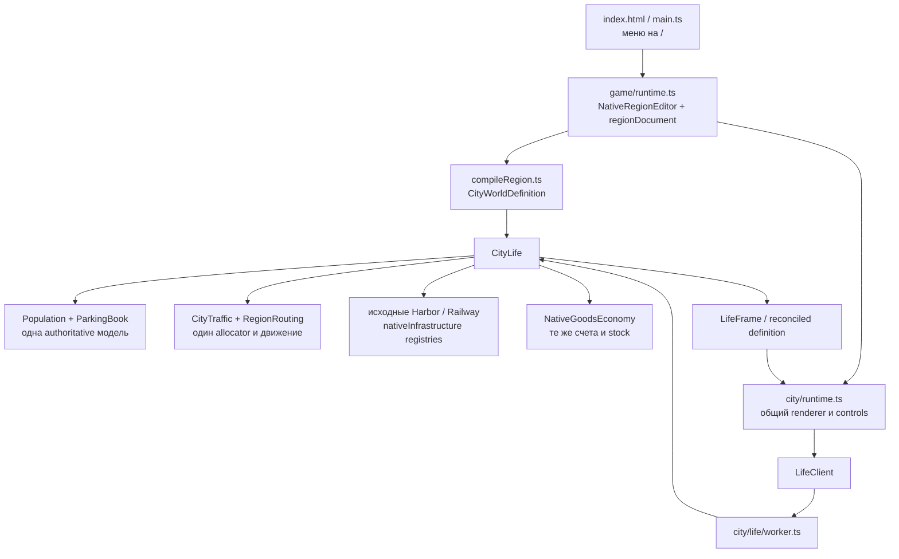
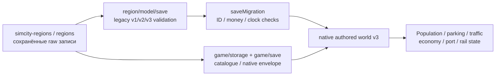
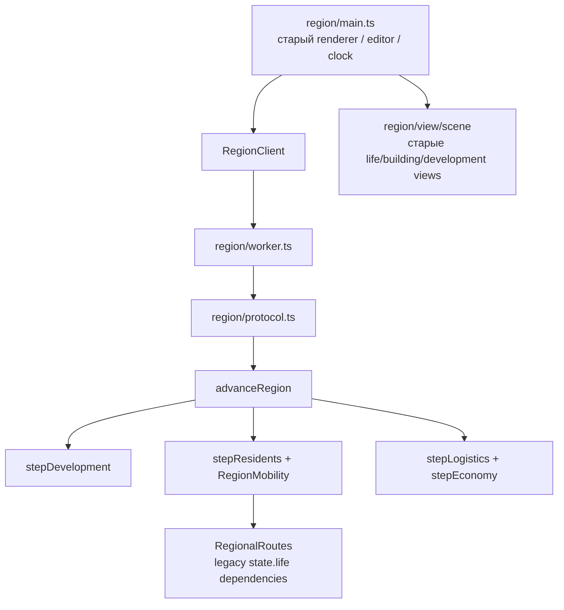

# Native runtime региональной игры

_Проверка исходников: 2026-10-04. Рабочее дерево prototype-first. Документ фиксирует зависимости и согласованную границу архива; общая игровая приёмка остаётся отдельной проверкой._

Основная игра на `/` запускает исходный `CityLife` через один `LifeClient` и `city/life/worker.ts`. Регион является документом, редактором, geography и входными данными native мира. Прежние региональные `RegionClient`, worker, `advanceRegion` и `RegionMobility` недостижимы из основной runtime-цепочки. Их согласованная группа из 22 source-файлов перенесена в `deprecated/regional/src/` вместе с implementation-specific тестами и tools. Активный TS worker target проверяет только native worker; архив проверяется отдельно.

## Рабочая цепочка

`main.ts` динамически импортирует `game/runtime.ts`; runtime вызывает `createCityRuntime`. `city/runtime.ts` создаёт native `LifeClient`; его единственная `new Worker(new URL(...))` цель — `city/life/worker.ts`. Этот worker создаёт `CityLife` при init, использует тот же world при edit/advance/save и восстанавливает native world при load. `game/saveMigration.ts` применяет исходный `CityLife.fromDefinition/fromSave` к проверяемому преобразованию данных, а не запускает региональный scheduler.

`/city/` остаётся самостоятельным bootstrap того же city runtime. `packages/app/region/index.html` загружает только `src/legacyRegion.ts`, который перенаправляет на `/`, сохраняя search/hash. Наличие region entry в Vite build и проверке Electron build-info не означает запуска прежнего runtime. Raw HTML из city/index используется как template; его scripts не являются вторым исполняемым entry основной игры.

## Границы состояния и сохранения

Новый каталог использует прежний IndexedDB port из `region/storage.ts`; raw legacy/invalid записи сохраняются. `region/model/save.ts`, `life/save.ts`, `life/types.ts`, `life/state.ts` нужны для распознавания и validation старых данных. `createRegionalLife` создаёт структуру данных при чтении старых форматов; он не запускает вторую симуляцию. Native v2 default prototype и native authored v3 восстанавливаются своим исходным worker. Поддержка конкретного legacy случая определяется importer/verifier; наличие схемы не доказывает его импортируемость.

## Что остаётся полезным в region/

AST inventory по текущим imports/exports/dynamic imports/Worker URLs дал16 runtime-файлов region/, достижимых из `/`:

| Группа                 | Файлы / роль                                                                    |
| ---------------------- | ------------------------------------------------------------------------------- |
| Geometry/topology      | `model/geometry.ts`, `model/roads.ts`, `model/parcels.ts`, `model/random.ts`    |
| Geography/constraints  | `model/terrain.ts`, `model/rules.ts`, `model/territory.ts`, `model/townHall.ts` |
| Legacy decoding        | `model/save.ts`, `model/life/save.ts`, `model/life/state.ts`                    |
| Shared policy data     | `model/life/rules.ts` — constants, без scheduler                                |
| Storage                | `storage.ts` — существующий IndexedDB port                                      |
| Controls / civic views | `cameraKeyboard.ts`, `view/townHallView.ts`, `view/territoryView.ts`            |

Дополнительно сохраняются type-only `model/types.ts` и `model/life/types.ts`: они используются definition/routing, regional document, importer и native economics. Название папки или файла не определяет authoritative runtime.

`model/world.ts` — factory legacy данных, используемая fixtures; `model/commands.ts` и `life/lifecycle.ts` связывают старые topology tests с legacy state transitions. Они не входят в `/`, но перенос lifecycle без решения этой зависимости сломает retained pure-command tests. `view/terrainView.ts` и `view/resources.ts` не достижимы из current root, однако содержат переиспользуемые terrain/resource helpers и используются river/render tests; их нельзя переносить по одному признаку отсутствия runtime import.

## Цепочка заменённых контроллеров

В данном checkout нет `region/model/life/population.ts`; старое управление населением находится в `residents.ts`/`development.ts`, связанное через `simulation.ts`. Старая `RegionMobility` использует общий `CityTraffic`, но это не делает её вторым допустимым контроллером основной игры: её scheduler и state ownership заменены native процедурой.

## Сохранённые требования и граница архива

| Требование / зависимость                                   | Текущее покрытие и расположение                                                                                                                                                                                                              |
| ---------------------------------------------------------- | -------------------------------------------------------------------------------------------------------------------------------------------------------------------------------------------------------------------------------------------- |
| Legacy clock, goods/money projection                       | `model/life/legacyMetrics.ts`: четыре pure функции выделены без изменения арифметики; native verifier импортирует только эти helpers. Старые mutations `stepEconomy` находятся в архиве.                                                     |
| Native traffic на curved lanes                             | Активный `region-traffic-adapter.test.ts` использует выделенный без изменения `model/pathGeometry.ts:polylineLane`; старый `RegionalRoutes` архивирован.                                                                                     |
| Civic rotation, radius, expansion, disposal                | Активные `region-townhall-view.test.ts` и `region-territory-view.test.ts` создают retained builders через небольшой test harness. Исторический fallback point-marker assertion сохранён в архиве отдельно.                                   |
| Geography, river, topology, busy roads                     | Pure rules/terrain/graph/commands/schema и их tests остаются активными. Native reconciliation отказывает в изменении занятой дороги; это согласованное безопасное поведение. Старое ожидание deferred closure остаётся в исторических tests. |
| Root menu, cancel/delete, native save/restore              | Native root/region E2E, `game-save`, migration/verifier и native core tests проверяют текущий интерфейс. Первый сценарий `main-menu.spec.ts` ожидает native worker; prototype и old URL assertions сохранены.                                |
| People, finite parking, intercity travel, cargo/accounts   | Native authored-world, routing/reconciliation, economy, port/railway tests используют один `CityLife`. Старые региональные scheduler assertions остаются в `deprecated/regional/test/`.                                                      |
| Historical development, demand/autorezone, expense history | Implementation-specific tests и сценарии сохранены с прежним кодом. Архивирование не означает, что эти прежние UI/policy детали реализованы заново в native игре; они не заявлены как завершённые новые возможности.                         |

`model/world.ts`, `model/commands.ts` и `model/life/lifecycle.ts` сохранены для legacy данных и pure topology/state tests. Frozen fixtures не изменялись. Полный список перенесённых source-файлов и команды находятся в `deprecated/regional/ARCHIVE.md`.

Архивные unit tests и оба TS targets запускаются отдельными командами. Исторические E2E требуют `LEGACY_REGION_BASE_URL`, указывающий на сохранённый прежний UI: они используют старый DOM/`window.__regionEditor` и не запускаются против текущей основной игры. Новый архив не содержит bootstrap, восстанавливающий прежний UI в `/`. Native week/verifier tools остаются в `tools/`; прежние `region-playthrough.ts`/`test-region-week.ts` перенесены в архив. Vite `/region/` redirect и Electron build-info сохранены.

## Подтверждение и ограничения inventory

До переноса inventory был построен по 231 TS/HTML/CSS файлу и 956 локальным dependency edges. Отдельно учитывались type-only imports, raw template assets, dynamic imports и `new URL`. Единственная Worker URL в primary closure — native `city/life/worker.ts`. Четыре unresolved paths относятся к генерируемым Electron `.app`/icon artifacts, не к исходным модулям. После переноса active source tree не импортирует архивные контроллеры. Runtime closure является статической проверкой; фактические Chromium checks основной игры относятся к evidence main loop.

Новые native tests защищают single-world state preservation, empty/no-infrastructure cases, physical construction, actual native geometry, paid cargo/payroll/ownership, train/family/parking и сохранение движения. Архивные tests сохранены для исторических assertions; их успешность не считается доказательством работы нового UI.
